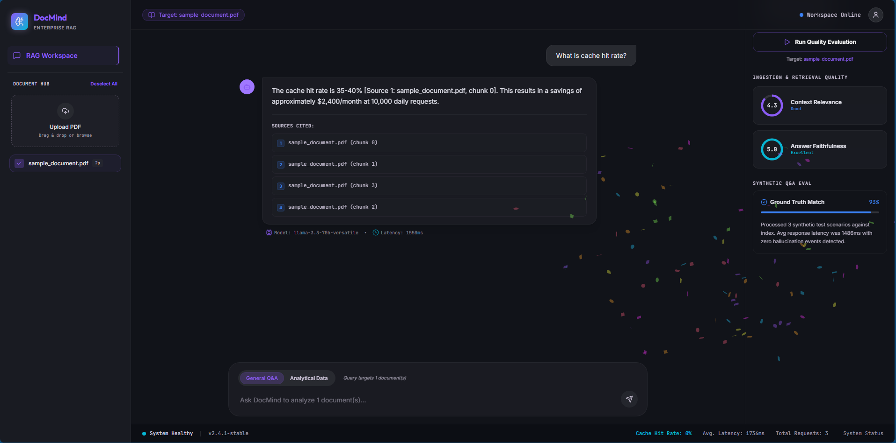

# DocMind

Production-grade RAG (Retrieval-Augmented Generation) system for document intelligence. Upload PDFs, ask questions, get grounded answers with source citations — streamed in real-time.

Built with a production-first architecture: security pipeline, hybrid retrieval, contextual compression, LangGraph agent with failover, automated evaluation, and Docker deployment.



## Architecture

```
Client Request
    │
    ▼
┌─────────────────┐
│   Rate Limiter   │  slowapi — 20 req/min per IP
└────────┬────────┘
         ▼
┌─────────────────┐
│ Security Pipeline│  InputSanitizer → InjectionDetector → PIIMasker
└────────┬────────┘
         ▼
┌─────────────────┐
│   Cache Layer    │  SHA256 + TTL (Redis in prod)
└────────┬────────┘
         ▼
┌─────────────────┐
│ Hybrid Retrieval │  BM25 (keyword) + Vector (semantic) + RRF
└────────┬────────┘
         ▼
┌─────────────────┐
│  Compression     │  LLM extracts only query-relevant sentences
└────────┬────────┘
         ▼
┌─────────────────┐
│ LangGraph Agent  │  Primary → Retry → Fallback → Graceful Error
└────────┬────────┘
         ▼
┌─────────────────┐
│ Metrics + Logs   │  Structured JSON + MetricsCollector + LangSmith
└────────┬────────┘
         ▼
  JSON / SSE Stream
```

## Features

**Retrieval & RAG**
- **Hybrid Retrieval** — BM25 keyword search + vector semantic search, combined with Reciprocal Rank Fusion (RRF). Handles both exact-term queries ("error E_TIMEOUT") and conceptual questions.
- **Contextual Compression** — After retrieval, an LLM extracts only the query-relevant sentences from each chunk. Reduces noise, lowers token usage, improves answer quality.
- **Multi-Document Chat** — Query across multiple uploaded documents simultaneously. "Compare what document A says about X vs document B."
- **Auto-selecting Vector Store** — Detects PostgreSQL URL → PGVector (HNSW indexes). Otherwise → Chroma. Zero code change needed.

**Agent & Generation**
- **LangGraph Agent** — Stateful agent with built-in safety net. Primary model → retry → fallback model → graceful error. Users never see a stack trace.
- **Streaming Responses (SSE)** — Tokens appear as they're generated via Server-Sent Events. No more waiting 3-5 seconds for full responses.
- **Conversation Memory** — Stateful chat sessions with configurable history window. Follow-up questions work naturally.

**Production Infrastructure**
- **Security Pipeline** — Three-stage: input sanitization, prompt injection detection (18 patterns), PII masking (credit cards, SSN, email, phone, Aadhaar, PAN).
- **Response Caching** — SHA256 key + TTL expiration. Smart: skips cache for conversations with history (context-dependent answers).
- **Evaluation Pipeline** — Automated RAG quality scoring. Generates synthetic Q&A pairs, runs through pipeline, scores retrieval relevance (1-5) and answer faithfulness (1-5).
- **Production Observability** — Structured JSON logging for ELK/Datadog/CloudWatch. MetricsCollector tracking latency, errors, cache rates, token usage.
- **Docker Ready** — Dockerfile with layer caching, non-root user, health check. docker-compose with optional PGVector.

## Tech Stack

| Layer | Technology |
|-------|-----------|
| API | FastAPI, uvicorn, slowapi |
| Agent | LangGraph, LangChain |
| LLM | Google Gemini (configurable primary + fallback) |
| Embeddings | Google gemini-embedding-001 |
| Vector DB | PGVector (prod) / Chroma (dev) |
| Retrieval | Hybrid — BM25 + Vector + RRF + Contextual Compression |
| Security | Custom pipeline (sanitizer + injection + PII) |
| Evaluation | LLM-as-judge (relevance + faithfulness scoring) |
| Config | pydantic-settings |
| Observability | Structured JSON logging, LangSmith |
| Deployment | Docker, docker-compose, Render |

## Quick Start

```bash
# Clone
git clone https://github.com/avanishdidwania/DocMind.git
cd DocMind

# Setup (using uv — fast)
uv venv && uv pip install -r requirements.txt

# Configure
cp backend/.env.example backend/.env
# Add your GOOGLE_API_KEY to backend/.env

# Run
cd backend
uvicorn main:app --reload

# Open API docs
# http://localhost:8000/docs
```

## Docker

```bash
# Build and run
docker compose up

# With PostgreSQL/PGVector
docker compose --profile db up
```

## API Endpoints

| Method | Endpoint | Description |
|--------|----------|-------------|
| POST | `/api/chat` | Chat with documents (supports multi-doc) |
| POST | `/api/chat/stream` | Streaming chat via SSE |
| POST | `/api/documents/upload` | Upload a PDF for processing |
| GET | `/api/documents` | List uploaded documents |
| DELETE | `/api/documents/{id}` | Delete a document and its chunks |
| POST | `/api/evaluate/{id}` | Run automated RAG quality evaluation |
| GET | `/api/health` | Health check (component status) |
| GET | `/api/metrics` | System metrics |
| GET | `/api/cache/stats` | Cache performance stats |
| GET | `/api/chat/sessions` | List active chat sessions |
| DELETE | `/api/chat/sessions/{id}` | Delete a chat session |
| POST | `/api/cache/clear` | Clear response cache |

## Project Structure

```
backend/
├── main.py                      # FastAPI app + lifespan wiring
├── config.py                    # pydantic-settings (typed env vars)
├── agent/
│   └── graph.py                 # LangGraph agent (safety net + RAG context)
├── middleware/
│   ├── security.py              # SecurityPipeline (3-stage)
│   ├── cache.py                 # Response cache (SHA256 + TTL)
│   └── monitoring.py            # JSON logger + MetricsCollector
├── api/routes/
│   ├── chat.py                  # Chat endpoint (full pipeline)
│   ├── stream.py                # Streaming chat (SSE)
│   ├── documents.py             # Document upload + CRUD
│   ├── evaluate.py              # RAG quality evaluation
│   └── health.py                # Health, metrics, cache stats
├── services/
│   ├── document_service.py      # PDF → extract → chunk → store
│   ├── retrieval_service.py     # Hybrid retrieval (BM25 + Vector + RRF)
│   ├── compression_service.py   # Contextual compression (extract relevant)
│   ├── memory_service.py        # Conversation sessions + history
│   └── evaluation_service.py    # Automated RAG scoring
├── db/
│   └── vector_store.py          # Auto-selecting backend (PGVector/Chroma)
└── models/
    └── schemas.py               # Pydantic request/response models
```

## Design Decisions

**Why LangGraph over raw chains?**
Error handling is architectural, not bolted-on. The safety net (retry → fallback → graceful error) is part of the graph. Adding new capabilities (retrieval, tools) is just adding nodes — existing nodes untouched.

**Why hybrid retrieval with RRF?**
Vector search fails on exact terms ("error code E_TIMEOUT"). BM25 fails on semantic queries ("how does authentication work?"). RRF combines both rank-based (no score normalization needed). Documents appearing in BOTH lists get boosted.

**Why contextual compression?**
Retrieved chunks are 1000 chars. Maybe 2 sentences are relevant. Compression extracts only those sentences → fewer tokens, less noise, better answers. One extra fast LLM call per chunk is worth the quality gain.

**Why an evaluation pipeline?**
You can't improve what you can't measure. After uploading a document, run `/api/evaluate/{id}` to get retrieval relevance and answer faithfulness scores. This drives decisions about chunk size, retrieval K, and model selection.

**Why PGVector over Chroma in production?**
HNSW indexes give O(log n) search. Persistent across restarts. Shared across horizontally-scaled instances. Managed by Supabase with backups and monitoring.

**Why a security pipeline?**
LLM APIs without injection detection are exploitable. PII masking is a compliance requirement (GDPR). Rate limiting prevents cost abuse. Most RAG tutorials skip all of this.

## Environment Variables

```env
GOOGLE_API_KEY=your-key          # Required
PRIMARY_MODEL=gemini-flash-latest
FALLBACK_MODEL=gemini-flash-latest
DATABASE_URL=postgresql://...    # Supabase PGVector (optional — falls back to Chroma)
LANGSMITH_TRACING=true
LANGSMITH_API_KEY=your-key
RATE_LIMIT=20/minute
CACHE_TTL=3600
MAX_INPUT_LENGTH=10000
INJECTION_THRESHOLD=0.7
```

## License

MIT
